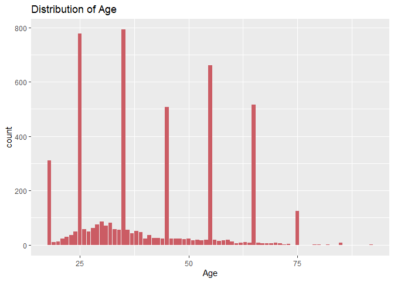
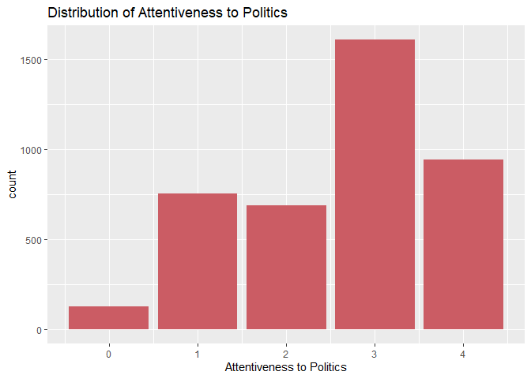
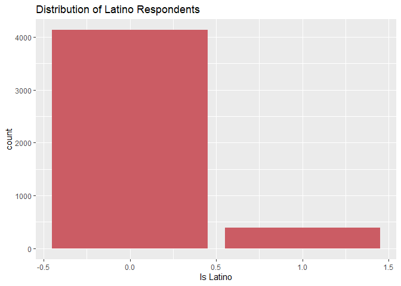

Perspective_Replication_and_Evaluation
================

## GitHub Documents

This is an R Markdown format used for publishing markdown documents to
GitHub. When you click the **Knit** button all R code chunks are run and
a markdown file (.md) suitable for publishing to GitHub is generated.

``` r
# Load Files
library(BayesTree)
library(data.table)
library(dismo)
```

    ## Loading required package: raster

    ## Loading required package: sp

``` r
library(dplyr)
```

    ## 
    ## Attaching package: 'dplyr'

    ## The following objects are masked from 'package:raster':
    ## 
    ##     intersect, select, union

    ## The following objects are masked from 'package:data.table':
    ## 
    ##     between, first, last

    ## The following objects are masked from 'package:stats':
    ## 
    ##     filter, lag

    ## The following objects are masked from 'package:base':
    ## 
    ##     intersect, setdiff, setequal, union

``` r
library(estimatr)
library(FindIt)
```

    ## Loading required package: arm

    ## Loading required package: MASS

    ## 
    ## Attaching package: 'MASS'

    ## The following object is masked from 'package:dplyr':
    ## 
    ##     select

    ## The following objects are masked from 'package:raster':
    ## 
    ##     area, select

    ## Loading required package: Matrix

    ## Loading required package: lme4

    ## 
    ## Attaching package: 'lme4'

    ## The following object is masked from 'package:raster':
    ## 
    ##     getData

    ## 
    ## arm (Version 1.13-1, built: 2022-8-25)

    ## Working directory is C:/Users/jonat/OneDrive/Documents/stats_hw/ALRA-Final

``` r
library(ggplot2)
library(ggpubr)
```

    ## 
    ## Attaching package: 'ggpubr'

    ## The following object is masked from 'package:raster':
    ## 
    ##     rotate

``` r
library(grf)
library(plotrix)
```

    ## 
    ## Attaching package: 'plotrix'

    ## The following object is masked from 'package:arm':
    ## 
    ##     rescale

``` r
library(rgeos)
```

    ## rgeos version: 0.5-9, (SVN revision 684)
    ##  GEOS runtime version: 3.9.3-CAPI-1.14.3 
    ##  Please note that rgeos will be retired by the end of 2023,
    ## plan transition to sf functions using GEOS at your earliest convenience.
    ##  GEOS using OverlayNG
    ##  Linking to sp version: 1.5-1 
    ##  Polygon checking: TRUE

``` r
library(rgdal)
```

    ## Please note that rgdal will be retired during 2023,
    ## plan transition to sf/stars/terra functions using GDAL and PROJ
    ## at your earliest convenience.
    ## See https://r-spatial.org/r/2022/04/12/evolution.html and https://github.com/r-spatial/evolution
    ## rgdal: version: 1.6-2, (SVN revision 1183)
    ## Geospatial Data Abstraction Library extensions to R successfully loaded
    ## Loaded GDAL runtime: GDAL 3.5.2, released 2022/09/02
    ## Path to GDAL shared files: C:/Users/jonat/AppData/Local/R/win-library/4.2/rgdal/gdal
    ## GDAL binary built with GEOS: TRUE 
    ## Loaded PROJ runtime: Rel. 8.2.1, January 1st, 2022, [PJ_VERSION: 821]
    ## Path to PROJ shared files: C:/Users/jonat/AppData/Local/R/win-library/4.2/rgdal/proj
    ## PROJ CDN enabled: FALSE
    ## Linking to sp version:1.5-1
    ## To mute warnings of possible GDAL/OSR exportToProj4() degradation,
    ## use options("rgdal_show_exportToProj4_warnings"="none") before loading sp or rgdal.

``` r
library(readstata13)
library(RColorBrewer)
library(sf)
```

    ## Linking to GEOS 3.9.3, GDAL 3.5.2, PROJ 8.2.1; sf_use_s2() is TRUE

``` r
library(sp)
library(tidyverse)
```

    ## ── Attaching packages
    ## ───────────────────────────────────────
    ## tidyverse 1.3.2 ──

    ## ✔ tibble  3.1.8     ✔ purrr   0.3.5
    ## ✔ tidyr   1.2.1     ✔ stringr 1.5.0
    ## ✔ readr   2.1.3     ✔ forcats 0.5.2
    ## ── Conflicts ────────────────────────────────────────── tidyverse_conflicts() ──
    ## ✖ dplyr::between()   masks data.table::between()
    ## ✖ tidyr::expand()    masks Matrix::expand()
    ## ✖ tidyr::extract()   masks raster::extract()
    ## ✖ dplyr::filter()    masks stats::filter()
    ## ✖ dplyr::first()     masks data.table::first()
    ## ✖ dplyr::lag()       masks stats::lag()
    ## ✖ dplyr::last()      masks data.table::last()
    ## ✖ tidyr::pack()      masks Matrix::pack()
    ## ✖ MASS::select()     masks dplyr::select(), raster::select()
    ## ✖ purrr::transpose() masks data.table::transpose()
    ## ✖ tidyr::unpack()    masks Matrix::unpack()

``` r
library(tree)
library(grid)
library(magrittr)
```

    ## 
    ## Attaching package: 'magrittr'
    ## 
    ## The following object is masked from 'package:purrr':
    ## 
    ##     set_names
    ## 
    ## The following object is masked from 'package:tidyr':
    ## 
    ##     extract
    ## 
    ## The following object is masked from 'package:raster':
    ## 
    ##     extract

``` r
library(quanteda)
```

    ## Package version: 3.2.3
    ## Unicode version: 13.0
    ## ICU version: 69.1
    ## Parallel computing: 16 of 16 threads used.
    ## See https://quanteda.io for tutorials and examples.

``` r
library(stm)
```

    ## stm v1.3.6 successfully loaded. See ?stm for help. 
    ##  Papers, resources, and other materials at structuraltopicmodel.com

``` r
rm(list = ls(all = TRUE))
#df <- read.csv("C:\\Users\\jonat\\Downloads\\diabetes.csv")

# Load Data ---------------------------------------------------------------
#setwd("C:/Users/dylan/Dropbox/Paper - PTinIR")
master <- read.dta13("./ptinir_pooled.dta")
```

    ## Warning in read.dta13("./ptinir_pooled.dta"): 
    ##    Factor codes of type double or float detected in variables
    ## 
    ##    treat_c, treat_t, c_pid, c_pid_long, c_dem,
    ##    c_attention, c_edu, dv_coop, dv_coop_dum,
    ##    c_income, c_interventionist, c_trust,
    ##    c_pt_allsides, c_pt_touched, c_pt_tender,
    ##    c_pt_nopov, c_pt_notsorry, dv_condition,
    ##    c_fpmil_milstrength, c_fpmil_influence,
    ##    c_fpmil_milbad, c_fpcoop_un,
    ##    c_fpcoop_multilateral, c_fpcoop_active,
    ##    c_fpcoop_iso, manip_ee, manip_ce
    ## 
    ##    No labels have been assigned.
    ##    Set option 'nonint.factors = TRUE' to assign labels anyway.

``` r
master <- master[!is.na(master$treat_pt),] # keep only observed counts in treatment
master <- master[!is.na(master$c_pid_long),] # drop incomplete PID responses
master$dv <- master$dv_coop
master$age <- as.factor(master$c_age)
```

``` r
 ggplot(data = master) +
   geom_bar(mapping = aes(x = treat_c),fill="#6f233f")+labs( title="Distribution of Country Treatment",x = "Country_Treatment")
```

    ## Warning: Removed 603 rows containing non-finite values (`stat_count()`).

<!-- -->

``` r
 ggplot(data = master) +
   geom_bar(mapping = aes(x = treat_t),fill="#a0445d")+labs( title="Distribution of Treaty Treatment",x = "Treaty_Condition")
```

    ## Warning: Removed 603 rows containing non-finite values (`stat_count()`).

<!-- -->

``` r
 ggplot(data = master) +
   geom_bar(mapping = aes(x = treat_pt),fill="#cb5c64")+labs( title="Distribution of Perspective Treatment",x = "Perspective_Treatment")
```

<!-- -->

``` r
ggplot(data = master) +
   geom_bar(mapping = aes(x = c_male),fill="#cb5c64")+labs( title="Distribution of Age",x = "Age")
```

    ## Warning: Removed 603 rows containing non-finite values (`stat_count()`).

<!-- -->

``` r
ggplot(data = master) +
    geom_bar(mapping = aes(x = c_male),fill="#cb5c64")+labs( title="Distribution of M/F",x = "Female=0 Male=1")
```

    ## Warning: Removed 603 rows containing non-finite values (`stat_count()`).

<!-- -->

``` r
 ggplot(data = master) +
  geom_bar(mapping = aes(x = c_income),fill="#cb5c64")+labs( title="Distribution of Income Level",x = "Income Level")
```

    ## Warning: Removed 4116 rows containing non-finite values (`stat_count()`).

<!-- -->

``` r
ggplot(data = master) +
    geom_bar(mapping = aes(x = c_edu),fill="#cb5c64")+labs( title="Distribution of Educational Level",x = "Educational Level")
```

    ## Warning: Removed 604 rows containing non-finite values (`stat_count()`).

<!-- -->

``` r
ggplot(data = master) +
    geom_bar(mapping = aes(x = c_attention),fill="#cb5c64")+labs( title="Distribution of Attentiveness to Politics",x = "Attentiveness to Politics")
```

    ## Warning: Removed 1011 rows containing non-finite values (`stat_count()`).

<!-- -->

``` r
 ggplot(data = master) +
   geom_bar(mapping = aes(x = c_pid_long),fill="#cb5c64")+labs( title="Distribution of Party Identification",x = "Party Identification")
```

<!-- -->

``` r
 ggplot(data = master) +
   geom_bar(mapping = aes(x = c_latino),fill="#cb5c64")+labs( title="Distribution of Latino Respondents",x = "Is Latino")
```

    ## Warning: Removed 603 rows containing non-finite values (`stat_count()`).

<!-- -->

``` r
m_set=filter(master,c_male==1)
f_set=filter(master,c_male==0)
count<-1:10;
for (x in seq_len(length(count))){
  #if(x==1){
  #  count[x]=100
  #}
  
  
  
  if (x%%2==0){
    count[x]=nrow(filter(m_set,dv_coop==(floor((x+1)/2))))
  #count[x]=0
    }
  if (x%%2==1){
    count[x]=nrow(filter(f_set,dv_coop==(floor((x+1)/2))))
  #count[x]=1
    }
    
}

Survey_Response <- c(rep("1" , 2) , rep("2" , 2) , rep("3" , 2) , rep("4" , 2),rep("5" , 2) )
gender<-rep(c("F","M"),5)
data <- data.frame(Survey_Response,gender,count)
```

``` r
ggplot(data, aes(fill=gender, y=count, x=Survey_Response)) + 
    geom_bar(position="dodge", stat="identity")+ ggtitle("Number of Responses by Support Level (Grouped by Gender)")
```

<!-- -->

``` r
l_set=filter(master,c_latino==1)
o_set=filter(master,c_latino==0)
count<-1:10;
for (x in seq_len(length(count))){
  #if(x==1){
  #  count[x]=100
  #}
  
  
  
  if (x%%2==0){
    count[x]=nrow(filter(l_set,dv_coop==(floor((x+1)/2))))
  #count[x]=0
    }
  if (x%%2==1){
    count[x]=nrow(filter(o_set,dv_coop==(floor((x+1)/2))))
  #count[x]=1
    }
    
}

Survey_Response <- c(rep("1" , 2) , rep("2" , 2) , rep("3" , 2) , rep("4" , 2),rep("5" , 2) )
latino<-rep(c("Not L","L"),5)
data <- data.frame(Survey_Response,latino,count)
```

``` r
ggplot(data, aes(fill=latino, y=count, x=Survey_Response)) + 
    geom_bar(position="dodge", stat="identity")+ ggtitle("Number of Responses by Support Level (Grouped by Latino)")
```

<!-- -->

``` r
nrow(master[master$c_latino==1,])
```

    ## [1] 997

``` r
nrow(master[master$c_latino==0,])
```

    ## [1] 4733

``` r
(nrow(master[master$c_male==1,]))/(nrow(master[master$c_male==1,])+nrow(master[master$c_male==0,]))
```

    ## [1] 0.4371728

## Replication of Significance in Country Prompt: India

``` r
mean <- mean(master$c_pt_index, na.rm = T)

master$t_des_dum <- ifelse(master$c_pt_index > median(master$c_pt_index, na.rm = TRUE), "Treat", "Control")
master$t_exp <- ifelse(master$treat_pt == 1, "Treat", "Control")
master$age <- as.factor(master$c_age)

# Set Variables -----------------------------------------------------------

master$dv <- master$dv_coop
master$treat <- master$t_exp

# Filter ------------------------------------------------------------------
df <- master[ !is.na(master$dv) & !is.na(master$treat),]
print(nrow(df))
```

    ## [1] 5122

``` r
df <- df[!is.na(df$treat_c)&(df$treat_c!=2),]
print(nrow(df))
```

    ## [1] 3078

``` r
  # Run Regression ----------------------------------------------------------
  
lm_fit <- lm(dv ~ as.factor(treat), data = df)
lm_fit_store <- tidy(lm_fit)
print("Reproduced Result 1")
```

    ## [1] "Reproduced Result 1"

``` r
print(summary(lm_fit))
```

    ## 
    ## Call:
    ## lm(formula = dv ~ as.factor(treat), data = df)
    ## 
    ## Residuals:
    ##     Min      1Q  Median      3Q     Max 
    ## -2.6454 -0.6454  0.3546  1.3546  1.4368 
    ## 
    ## Coefficients:
    ##                       Estimate Std. Error t value Pr(>|t|)    
    ## (Intercept)            3.56315    0.03146 113.246   <2e-16 ***
    ## as.factor(treat)Treat  0.08221    0.04576   1.796   0.0725 .  
    ## ---
    ## Signif. codes:  0 '***' 0.001 '**' 0.01 '*' 0.05 '.' 0.1 ' ' 1
    ## 
    ## Residual standard error: 1.268 on 3076 degrees of freedom
    ## Multiple R-squared:  0.001048,   Adjusted R-squared:  0.0007232 
    ## F-statistic: 3.227 on 1 and 3076 DF,  p-value: 0.07254

## Evaluating the Result:

# Adding features to the regression

Adding Age…

``` r
  # Run Regression ----------------------------------------------------------
  
lm_fit <- lm(dv ~ as.factor(treat)+c_age, data = df)
lm_fit_store <- tidy(lm_fit)

print(summary(lm_fit))
```

    ## 
    ## Call:
    ## lm(formula = dv ~ as.factor(treat) + c_age, data = df)
    ## 
    ## Residuals:
    ##     Min      1Q  Median      3Q     Max 
    ## -2.6775 -0.6541  0.3610  1.3459  1.4844 
    ## 
    ## Coefficients:
    ##                        Estimate Std. Error t value Pr(>|t|)    
    ## (Intercept)            3.618624   0.067396  53.692   <2e-16 ***
    ## as.factor(treat)Treat  0.083579   0.045788   1.825    0.068 .  
    ## c_age                 -0.001373   0.001476  -0.931    0.352    
    ## ---
    ## Signif. codes:  0 '***' 0.001 '**' 0.01 '*' 0.05 '.' 0.1 ' ' 1
    ## 
    ## Residual standard error: 1.268 on 3075 degrees of freedom
    ## Multiple R-squared:  0.001329,   Adjusted R-squared:  0.0006797 
    ## F-statistic: 2.046 on 2 and 3075 DF,  p-value: 0.1294

Adding Education Level…

``` r
  # Run Regression ----------------------------------------------------------
  
lm_fit <- lm(dv ~ as.factor(treat)+c_edu, data = df)
lm_fit_store <- tidy(lm_fit)

print(summary(lm_fit))
```

    ## 
    ## Call:
    ## lm(formula = dv ~ as.factor(treat) + c_edu, data = df)
    ## 
    ## Residuals:
    ##     Min      1Q  Median      3Q     Max 
    ## -2.8477 -0.6843  0.3157  1.3076  1.6264 
    ## 
    ## Coefficients:
    ##                       Estimate Std. Error t value Pr(>|t|)    
    ## (Intercept)            3.29592    0.07901  41.714  < 2e-16 ***
    ## as.factor(treat)Treat  0.08579    0.04569   1.878 0.060544 .  
    ## c_edu                  0.07767    0.02104   3.691 0.000227 ***
    ## ---
    ## Signif. codes:  0 '***' 0.001 '**' 0.01 '*' 0.05 '.' 0.1 ' ' 1
    ## 
    ## Residual standard error: 1.265 on 3074 degrees of freedom
    ##   (1 observation deleted due to missingness)
    ## Multiple R-squared:  0.005446,   Adjusted R-squared:  0.004799 
    ## F-statistic: 8.417 on 2 and 3074 DF,  p-value: 0.0002263

Adding Sex…

``` r
  # Run Regression ----------------------------------------------------------
  
lm_fit <- lm(dv ~ as.factor(treat)+c_male, data = df)
lm_fit_store <- tidy(lm_fit)

print(summary(lm_fit))
```

    ## 
    ## Call:
    ## lm(formula = dv ~ as.factor(treat) + c_male, data = df)
    ## 
    ## Residuals:
    ##     Min      1Q  Median      3Q     Max 
    ## -2.6780 -0.6780  0.3961  1.3220  1.4793 
    ## 
    ## Coefficients:
    ##                       Estimate Std. Error t value Pr(>|t|)    
    ## (Intercept)            3.59476    0.03711  96.877   <2e-16 ***
    ## as.factor(treat)Treat  0.08321    0.04576   1.819   0.0691 .  
    ## c_male                -0.07403    0.04610  -1.606   0.1084    
    ## ---
    ## Signif. codes:  0 '***' 0.001 '**' 0.01 '*' 0.05 '.' 0.1 ' ' 1
    ## 
    ## Residual standard error: 1.267 on 3075 degrees of freedom
    ## Multiple R-squared:  0.001885,   Adjusted R-squared:  0.001236 
    ## F-statistic: 2.904 on 2 and 3075 DF,  p-value: 0.05497

Adding Age, Education Level, and Sex…

``` r
  # Run Regression ----------------------------------------------------------
  
lm_fit <- lm(dv ~ as.factor(treat)+c_age+c_edu+c_male, data = df)
lm_fit_store <- tidy(lm_fit)

print(summary(lm_fit))
```

    ## 
    ## Call:
    ## lm(formula = dv ~ as.factor(treat) + c_age + c_edu + c_male, 
    ##     data = df)
    ## 
    ## Residuals:
    ##     Min      1Q  Median      3Q     Max 
    ## -2.8705 -0.6765  0.3347  1.2826  1.7181 
    ## 
    ## Coefficients:
    ##                        Estimate Std. Error t value Pr(>|t|)    
    ## (Intercept)            3.388088   0.101845  33.267  < 2e-16 ***
    ## as.factor(treat)Treat  0.088955   0.045702   1.946 0.051695 .  
    ## c_age                 -0.001602   0.001483  -1.080 0.280176    
    ## c_edu                  0.082124   0.021165   3.880 0.000107 ***
    ## c_male                -0.100235   0.046612  -2.150 0.031599 *  
    ## ---
    ## Signif. codes:  0 '***' 0.001 '**' 0.01 '*' 0.05 '.' 0.1 ' ' 1
    ## 
    ## Residual standard error: 1.264 on 3072 degrees of freedom
    ##   (1 observation deleted due to missingness)
    ## Multiple R-squared:  0.007164,   Adjusted R-squared:  0.005872 
    ## F-statistic: 5.542 on 4 and 3072 DF,  p-value: 0.0001918

Adding features only proved to increase the significance of the
perspective treatment, we can also see that education and sex are also
significant features in predicting response.

# Removing a small fraction of the dataset

Since education and sex seemed to also have significant effect on the
outcome, I tried to remove certain data points based on those features.
From the regression above it appeared an increase in education decreased
the difference between control and it also showed that male respondents
caused a decrease in the difference compared to female responses:

Using age to reduce the percentage removed, these were the results of
regression on the dataset…

Without Men over 50 who have an education level above 1 :

``` r
df_loop <- df[!(df$c_edu>=2&df$c_age>50&df$c_male==1),]

  # Run Regression ----------------------------------------------------------
  
lm_fit <- lm(dv ~ as.factor(treat), data = df_loop)
lm_fit_store <- tidy(lm_fit)

print(summary(lm_fit))
```

    ## 
    ## Call:
    ## lm(formula = dv ~ as.factor(treat), data = df_loop)
    ## 
    ## Residuals:
    ##     Min      1Q  Median      3Q     Max 
    ## -2.6682 -0.6682  0.3318  1.3318  1.4137 
    ## 
    ## Coefficients:
    ##                       Estimate Std. Error t value Pr(>|t|)    
    ## (Intercept)            3.58635    0.03244 110.540   <2e-16 ***
    ## as.factor(treat)Treat  0.08187    0.04744   1.726   0.0845 .  
    ## ---
    ## Signif. codes:  0 '***' 0.001 '**' 0.01 '*' 0.05 '.' 0.1 ' ' 1
    ## 
    ## Residual standard error: 1.242 on 2750 degrees of freedom
    ## Multiple R-squared:  0.001082,   Adjusted R-squared:  0.0007185 
    ## F-statistic: 2.978 on 1 and 2750 DF,  p-value: 0.08451

Without Men over 50 who have an education level above 2:

``` r
df_loop <- df[!(df$c_edu>=3&df$c_age>50&df$c_male==1),]

  # Run Regression ----------------------------------------------------------
  
lm_fit <- lm(dv ~ as.factor(treat), data = df_loop)
lm_fit_store <- tidy(lm_fit)

print(summary(lm_fit))
```

    ## 
    ## Call:
    ## lm(formula = dv ~ as.factor(treat), data = df_loop)
    ## 
    ## Residuals:
    ##     Min      1Q  Median      3Q     Max 
    ## -2.6511 -0.6511  0.3489  1.3489  1.4208 
    ## 
    ## Coefficients:
    ##                       Estimate Std. Error t value Pr(>|t|)    
    ## (Intercept)            3.57919    0.03233 110.701   <2e-16 ***
    ## as.factor(treat)Treat  0.07193    0.04708   1.528    0.127    
    ## ---
    ## Signif. codes:  0 '***' 0.001 '**' 0.01 '*' 0.05 '.' 0.1 ' ' 1
    ## 
    ## Residual standard error: 1.248 on 2818 degrees of freedom
    ## Multiple R-squared:  0.0008277,  Adjusted R-squared:  0.0004732 
    ## F-statistic: 2.335 on 1 and 2818 DF,  p-value: 0.1266

Without Men over 55 who have an education level above 2:

``` r
df_loop <- df[!(df$c_edu>=3&df$c_age>55&df$c_male==1),]

  # Run Regression ----------------------------------------------------------
  
lm_fit <- lm(dv ~ as.factor(treat), data = df_loop)
lm_fit_store <- tidy(lm_fit)

print(summary(lm_fit))
```

    ## 
    ## Call:
    ## lm(formula = dv ~ as.factor(treat), data = df_loop)
    ## 
    ## Residuals:
    ##     Min      1Q  Median      3Q     Max 
    ## -2.6318 -0.6318  0.3682  1.3682  1.4326 
    ## 
    ## Coefficients:
    ##                       Estimate Std. Error t value Pr(>|t|)    
    ## (Intercept)            3.56738    0.03201 111.445   <2e-16 ***
    ## as.factor(treat)Treat  0.06447    0.04658   1.384    0.166    
    ## ---
    ## Signif. codes:  0 '***' 0.001 '**' 0.01 '*' 0.05 '.' 0.1 ' ' 1
    ## 
    ## Residual standard error: 1.261 on 2937 degrees of freedom
    ## Multiple R-squared:  0.0006518,  Adjusted R-squared:  0.0003115 
    ## F-statistic: 1.916 on 1 and 2937 DF,  p-value: 0.1664

…

The greatest p-value I could get from removing a percentage of the data
set was about 0.083 which is still significant at an alpha of 0.1 after
removing Men over 55 who have an education level above 2: 139
Respondents (4.59% of the data set)

# Cross validation

``` r
lmp <- function (modelobject) {
    if (class(modelobject) != "lm") stop("Not an object of class 'lm' ")
    f <- summary(modelobject)$fstatistic
    p <- pf(f[1],f[2],f[3],lower.tail=F)
    attributes(p) <- NULL
    return(p)
}
```

``` r
n<-nrow(df)
k<-15
folds <- sample(k, n, replace=TRUE)
df_ver<-df[!is.na(df$c_age)& !is.na(df$c_male),]
i <- 1
folds_RMSE <- c()
folds_coeffs <-c()
folds_error_rate <-c()
folds_p<-c()
for(i in seq_len(k)){
    is_train <- folds != i
    head(is_train)
    is_test <- !is_train
    
    train_df <- df_ver[is_train, ]
    test_df <- df_ver[is_test, ]
    
    mod <- lm(dv ~ as.factor(treat), data = train_df)
    y_hat <- predict(mod, newdata = test_df)
    new_error <- (test_df$dv - y_hat)
    
    folds_RMSE[i] <- sqrt(mean(new_error ^2))
    folds_p[i]<-lmp(mod)
    folds_coeffs[i]<-mod$coefficients[2]
    
}
#worst case RMSE fold:
max(folds_RMSE)
```

    ## [1] 1.387669

``` r
#Average RMSE
mean(folds_RMSE)
```

    ## [1] 1.266007

``` r
#Average Coefficient
mean(folds_coeffs)
```

    ## [1] 0.08223138

``` r
#Stability of Coefficients over Folds
sd(folds_coeffs)
```

    ## [1] 0.01151244

``` r
mean(folds_p/2)
```

    ## [1] 0.04554724

``` r
print("Mean RMSE over all folds:")
```

    ## [1] "Mean RMSE over all folds:"

``` r
#Average RMSE
mean(folds_RMSE)
```

    ## [1] 1.266007

``` r
print("Average B1 over all folds:")
```

    ## [1] "Average B1 over all folds:"

``` r
#Average Coefficient
mean(folds_coeffs)
```

    ## [1] 0.08223138

``` r
print("Sd of B1 over all folds:")
```

    ## [1] "Sd of B1 over all folds:"

``` r
#Stability of Coefficients over Folds
sd(folds_coeffs)
```

    ## [1] 0.01151244

``` r
print("P-value range over all folds:")
```

    ## [1] "P-value range over all folds:"

``` r
quantile(folds_p/2)
```

    ##         0%        25%        50%        75%       100% 
    ## 0.02058372 0.02568194 0.04909598 0.06765774 0.07711619

``` r
print("Mean P-value over all folds:")
```

    ## [1] "Mean P-value over all folds:"

``` r
mean(folds_p/2)
```

    ## [1] 0.04554724

Evaluating the model using 15-fold cross validation, I get an average
rmse (root-mean-square error) of about 1.267, meaning that on average
the predictions for my test folds were about 1.267 off the actual value
(keep in mind the guesses ranged in value from 1 to 5, however the model
only had two x-values, control and treatment). The Standard deviation of
the coefficients came to be about 0.012, which is about 14% of the mean
of the coefficients (0.082), and the coefficients seemed to have an
average p-value of about 0.046 implying significance.

``` r
boxplot(folds_coeffs)
```

<!-- -->
\## Replication of Significance in Country Prompt: China

``` r
mean <- mean(master$c_pt_index, na.rm = T)

master$t_des_dum <- ifelse(master$c_pt_index > median(master$c_pt_index, na.rm = TRUE), "Treat", "Control")
master$t_exp <- ifelse(master$treat_pt == 1, "Treat", "Control")
master$age <- as.factor(master$c_age)

# Set Variables -----------------------------------------------------------

master$dv <- master$dv_coop
master$treat <- master$t_exp

# Filter ------------------------------------------------------------------
df <- master[ !is.na(master$dv) & !is.na(master$treat),]
print(nrow(df))
```

    ## [1] 5122

``` r
df <- df[!is.na(df$treat_c)&(df$treat_c!=1),]
print(nrow(df))
```

    ## [1] 3064

``` r
  # Run Regression ----------------------------------------------------------
  
lm_fit <- lm(dv ~ as.factor(treat), data = df)
lm_fit_store <- tidy(lm_fit)
print("Reproduced Result 2")
```

    ## [1] "Reproduced Result 2"

``` r
print(summary(lm_fit))
```

    ## 
    ## Call:
    ## lm(formula = dv ~ as.factor(treat), data = df)
    ## 
    ## Residuals:
    ##     Min      1Q  Median      3Q     Max 
    ## -2.6065 -0.6065  0.3935  1.3935  1.4368 
    ## 
    ## Coefficients:
    ##                       Estimate Std. Error t value Pr(>|t|)    
    ## (Intercept)            3.56315    0.03114 114.422   <2e-16 ***
    ## as.factor(treat)Treat  0.04337    0.04541   0.955     0.34    
    ## ---
    ## Signif. codes:  0 '***' 0.001 '**' 0.01 '*' 0.05 '.' 0.1 ' ' 1
    ## 
    ## Residual standard error: 1.255 on 3062 degrees of freedom
    ## Multiple R-squared:  0.0002978,  Adjusted R-squared:  -2.867e-05 
    ## F-statistic: 0.9122 on 1 and 3062 DF,  p-value: 0.3396

## Evaluating the Result:

# Adding features to the regression

Adding Age…

``` r
  # Run Regression ----------------------------------------------------------
  
lm_fit <- lm(dv ~ as.factor(treat)+c_age, data = df)
lm_fit_store <- tidy(lm_fit)

print(summary(lm_fit))
```

    ## 
    ## Call:
    ## lm(formula = dv ~ as.factor(treat) + c_age, data = df)
    ## 
    ## Residuals:
    ##     Min      1Q  Median      3Q     Max 
    ## -2.6999 -0.6327  0.3713  1.3483  1.5737 
    ## 
    ## Coefficients:
    ##                        Estimate Std. Error t value Pr(>|t|)    
    ## (Intercept)            3.722841   0.066834  55.703  < 2e-16 ***
    ## as.factor(treat)Treat  0.048246   0.045398   1.063  0.28799    
    ## c_age                 -0.003954   0.001465  -2.700  0.00698 ** 
    ## ---
    ## Signif. codes:  0 '***' 0.001 '**' 0.01 '*' 0.05 '.' 0.1 ' ' 1
    ## 
    ## Residual standard error: 1.253 on 3061 degrees of freedom
    ## Multiple R-squared:  0.002672,   Adjusted R-squared:  0.002021 
    ## F-statistic: 4.101 on 2 and 3061 DF,  p-value: 0.01665

Adding Education Level…

``` r
  # Run Regression ----------------------------------------------------------
  
lm_fit <- lm(dv ~ as.factor(treat)+c_edu, data = df)
lm_fit_store <- tidy(lm_fit)

print(summary(lm_fit))
```

    ## 
    ## Call:
    ## lm(formula = dv ~ as.factor(treat) + c_edu, data = df)
    ## 
    ## Residuals:
    ##     Min      1Q  Median      3Q     Max 
    ## -2.8687 -0.6693  0.3307  1.3307  1.6802 
    ## 
    ## Coefficients:
    ##                       Estimate Std. Error t value Pr(>|t|)    
    ## (Intercept)            3.22015    0.07925  40.634  < 2e-16 ***
    ## as.factor(treat)Treat  0.05052    0.04529   1.115    0.265    
    ## c_edu                  0.09966    0.02116   4.709  2.6e-06 ***
    ## ---
    ## Signif. codes:  0 '***' 0.001 '**' 0.01 '*' 0.05 '.' 0.1 ' ' 1
    ## 
    ## Residual standard error: 1.25 on 3060 degrees of freedom
    ##   (1 observation deleted due to missingness)
    ## Multiple R-squared:  0.007486,   Adjusted R-squared:  0.006837 
    ## F-statistic: 11.54 on 2 and 3060 DF,  p-value: 1.017e-05

Adding Sex…

``` r
  # Run Regression ----------------------------------------------------------
  
lm_fit <- lm(dv ~ as.factor(treat)+c_male, data = df)
lm_fit_store <- tidy(lm_fit)

print(summary(lm_fit))
```

    ## 
    ## Call:
    ## lm(formula = dv ~ as.factor(treat) + c_male, data = df)
    ## 
    ## Residuals:
    ##    Min     1Q Median     3Q    Max 
    ## -2.622 -0.622  0.378  1.378  1.459 
    ## 
    ## Coefficients:
    ##                       Estimate Std. Error t value Pr(>|t|)    
    ## (Intercept)            3.57996    0.03684  97.179   <2e-16 ***
    ## as.factor(treat)Treat  0.04205    0.04544   0.925    0.355    
    ## c_male                -0.03936    0.04609  -0.854    0.393    
    ## ---
    ## Signif. codes:  0 '***' 0.001 '**' 0.01 '*' 0.05 '.' 0.1 ' ' 1
    ## 
    ## Residual standard error: 1.255 on 3061 degrees of freedom
    ## Multiple R-squared:  0.0005359,  Adjusted R-squared:  -0.0001171 
    ## F-statistic: 0.8207 on 2 and 3061 DF,  p-value: 0.4402

Adding Age, Education Level, and Sex…

``` r
  # Run Regression ----------------------------------------------------------
  
lm_fit <- lm(dv ~ as.factor(treat)+c_age+c_edu+c_male, data = df)
lm_fit_store <- tidy(lm_fit)

print(summary(lm_fit))
```

    ## 
    ## Call:
    ## lm(formula = dv ~ as.factor(treat) + c_age + c_edu + c_male, 
    ##     data = df)
    ## 
    ## Residuals:
    ##     Min      1Q  Median      3Q     Max 
    ## -2.9152 -0.6776  0.3224  1.2689  1.8046 
    ## 
    ## Coefficients:
    ##                        Estimate Std. Error t value Pr(>|t|)    
    ## (Intercept)            3.411743   0.100192  34.052  < 2e-16 ***
    ## as.factor(treat)Treat  0.053462   0.045283   1.181  0.23785    
    ## c_age                 -0.004269   0.001469  -2.907  0.00368 ** 
    ## c_edu                  0.103829   0.021258   4.884 1.09e-06 ***
    ## c_male                -0.078476   0.046432  -1.690  0.09111 .  
    ## ---
    ## Signif. codes:  0 '***' 0.001 '**' 0.01 '*' 0.05 '.' 0.1 ' ' 1
    ## 
    ## Residual standard error: 1.249 on 3058 degrees of freedom
    ##   (1 observation deleted due to missingness)
    ## Multiple R-squared:  0.01083,    Adjusted R-squared:  0.009533 
    ## F-statistic: 8.368 on 4 and 3058 DF,  p-value: 1.037e-06

Adding features only proved to increase the significance of the
perspective treatment, we can also see that education and sex are also
significant features in predicting response.

# Removing a small fraction of the dataset

Since education and sex seemed to also have significant effect on the
outcome, I tried to remove certain data points based on those features.
From the regression above it appeared an increase in education decreased
the difference between control and it also showed that male respondents
caused a decrease in the difference compared to female responses:

Using age to reduce the percentage removed, these were the results of
regression on the dataset…

Without Men over 50 who have an education level above 1 :

``` r
df_loop <- df[!(df$c_edu>=2&df$c_age>50&df$c_male==1),]

  # Run Regression ----------------------------------------------------------
  
lm_fit <- lm(dv ~ as.factor(treat), data = df_loop)
lm_fit_store <- tidy(lm_fit)

print(summary(lm_fit))
```

    ## 
    ## Call:
    ## lm(formula = dv ~ as.factor(treat), data = df_loop)
    ## 
    ## Residuals:
    ##     Min      1Q  Median      3Q     Max 
    ## -2.6243 -0.6243  0.3757  1.3757  1.4137 
    ## 
    ## Coefficients:
    ##                       Estimate Std. Error t value Pr(>|t|)    
    ## (Intercept)            3.58635    0.03225 111.206   <2e-16 ***
    ## as.factor(treat)Treat  0.03797    0.04712   0.806     0.42    
    ## ---
    ## Signif. codes:  0 '***' 0.001 '**' 0.01 '*' 0.05 '.' 0.1 ' ' 1
    ## 
    ## Residual standard error: 1.234 on 2754 degrees of freedom
    ## Multiple R-squared:  0.0002358,  Adjusted R-squared:  -0.0001272 
    ## F-statistic: 0.6495 on 1 and 2754 DF,  p-value: 0.4204

Without Men over 50 who have an education level above 2:

``` r
df_loop <- df[!(df$c_edu>=3&df$c_age>50&df$c_male==1),]

  # Run Regression ----------------------------------------------------------
  
lm_fit <- lm(dv ~ as.factor(treat), data = df_loop)
lm_fit_store <- tidy(lm_fit)

print(summary(lm_fit))
```

    ## 
    ## Call:
    ## lm(formula = dv ~ as.factor(treat), data = df_loop)
    ## 
    ## Residuals:
    ##     Min      1Q  Median      3Q     Max 
    ## -2.6149 -0.6149  0.3851  1.3851  1.4208 
    ## 
    ## Coefficients:
    ##                       Estimate Std. Error t value Pr(>|t|)    
    ## (Intercept)            3.57919    0.03211 111.477   <2e-16 ***
    ## as.factor(treat)Treat  0.03567    0.04685   0.761    0.447    
    ## ---
    ## Signif. codes:  0 '***' 0.001 '**' 0.01 '*' 0.05 '.' 0.1 ' ' 1
    ## 
    ## Residual standard error: 1.239 on 2807 degrees of freedom
    ## Multiple R-squared:  0.0002064,  Adjusted R-squared:  -0.0001498 
    ## F-statistic: 0.5794 on 1 and 2807 DF,  p-value: 0.4466

Without Men over 55 who have an education level above 2:

``` r
df_loop <- df[!(df$c_edu>=3&df$c_age>55&df$c_male==1),]

  # Run Regression ----------------------------------------------------------
  
lm_fit <- lm(dv ~ as.factor(treat), data = df_loop)
lm_fit_store <- tidy(lm_fit)

print(summary(lm_fit))
```

    ## 
    ## Call:
    ## lm(formula = dv ~ as.factor(treat), data = df_loop)
    ## 
    ## Residuals:
    ##     Min      1Q  Median      3Q     Max 
    ## -2.6071 -0.6071  0.3929  1.3929  1.4326 
    ## 
    ## Coefficients:
    ##                       Estimate Std. Error t value Pr(>|t|)    
    ## (Intercept)            3.56738    0.03166  112.67   <2e-16 ***
    ## as.factor(treat)Treat  0.03977    0.04622    0.86     0.39    
    ## ---
    ## Signif. codes:  0 '***' 0.001 '**' 0.01 '*' 0.05 '.' 0.1 ' ' 1
    ## 
    ## Residual standard error: 1.247 on 2921 degrees of freedom
    ## Multiple R-squared:  0.0002534,  Adjusted R-squared:  -8.885e-05 
    ## F-statistic: 0.7404 on 1 and 2921 DF,  p-value: 0.3896

…

The greatest p-value I could get from removing a percentage of the data
set was about 0.083 which is still significant at an alpha of 0.1 after
removing Men over 55 who have an education level above 2: 139
Respondents (4.59% of the data set)
